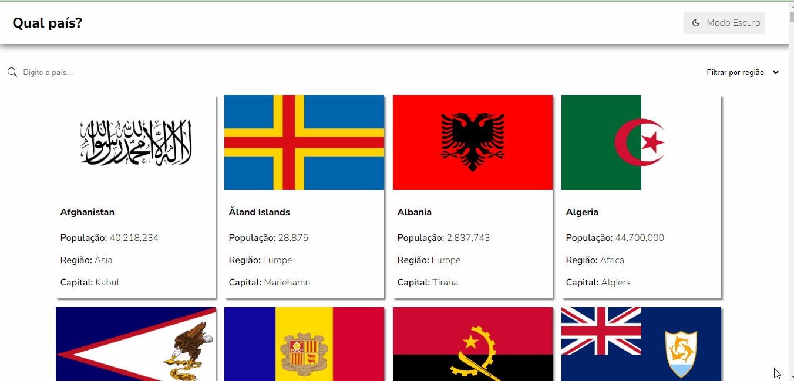

# Country Search

O country search é uma lista que contém todos os países com algumas informação, como população, região, capital, entre muitos outros. Você usuário pode pesquisar o nome do país ou pode fazer uma filtragem por região. Para ver sua especificação basta clicar no quadro do país e será direcionando pra uma página contendo mais informação.

## Instalação

1. Clone o repositório: git clone https://github.com/tobiasramos/country-search.git
2. Acesse o diretório do projeto: cd country-search
3. Instale as dependências: npm install

## Projeto em execução

